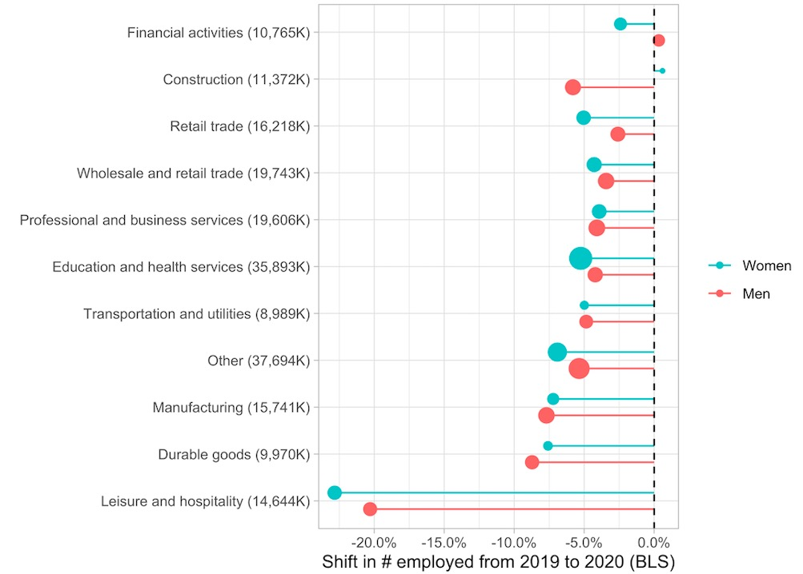

```{r setup, include=FALSE}

knitr::opts_chunk$set(cache = TRUE, warning = FALSE, message = FALSE,
                      echo = TRUE, dpi = 300, cache.lazy = FALSE,
                      styler = TRUE, fig.path = "static")

```

# Introduction

In this post I'm going to reproduce an unusual chart I saw David Robinson make during one of his recent Tidy Tuesday screencasts looking at data from the US Bureau of Labour Statistics.

The point of this exercise is to a) force me to work through the steps that went in to making it, which improves my data visualisation skills, and b) give me something to refer back to in future if I want to make something similar for another dataset. It might even be useful for other people, hence why I'm sharing it!

Some of David's code used deprecated functions like `gather()` and `fct_lump()`, so I'll also be adapting it slightly in order to improve my familiarity with the latest innovations in R.

The chart's called a "lollipop plot" and I think it does a really neat job of showing how the pandemic impacted US job numbers in 2020, broken down by industry and gender. 

Here's the plot:

```{r plot_image, echo=FALSE, fig.cap="", out.width = '80%'}
#knitr::include_graphics("lollipop_plot_of_interest2.png")


```

It shows that the public administration sector was the only industry to win from the pandemic, while leisure and hopsitality lost heaviily; and that whether men or women lost more jobs was dependent on the industry.

Let's reproduce the plot in steps.

# Load libraries and data

First we load the relevant R packages and the dataset itself. In this case there were two datasets - one about employment figures and one about earnings, so we load just the employment data into an object called `employed`.

```{r Load, message=FALSE, warning=FALSE}
library(tidyverse)
library(tidytuesdayR)
library(scales)
library(glue)
theme_set(theme_light())

tt <- tt_load("2021-02-23")
employed <- tt$employed

```


# Exploratory data analysis

Let's take an initial look at the data:

```{r EDA}
head(employed)
```

So we have employment numbers broken down by:
* Industry
* Major occupation
* Minor ocupation
* Race/gender
* Year.

Further exploratory analysis (not shown) reveals that we have 25 different industries, 5 different major occupations, 12 minor occupations, and 6 values for race/gender. We also have 660 missing values in the employment number columns so we'll need to deal with this. 

If we were doing a proper analysis/modelling project we'd need to do more thorough EDA here but this is enough for now.

# Data cleaning

Let's clean this data up a bit. Most importantly we need to:

1. Add another column which will make it easier for us to slice our data by race, gender or not at all. We'll call this `dimension`.
2. Remove any records with missing employment figures.
3. Reduce the number of industries from 25 down to the biggest 10 and lump the remaining 15 into an "other" category 
* For this we'll use `fct_lump_n()` instead of `fct_lump()` which was used in the original code.

```{r Cleaning}

employed_cleaned <- employed %>%
  mutate(
    dimension = case_when(
              race_gender == "TOTAL" ~ "Total",
              race_gender %in% c("Men", "Women") ~ "Gender",
              TRUE ~ "Race")) %>% 
  filter(!is.na(employ_n)) %>%
  mutate(industry = fct_lump_n(industry, n=10, w = employ_n), # note to self: same args as fct_lump() from original code
         year = forcats::as_factor(year))

head(employed_cleaned)
```

# Visualisation

Now we can get to the visualising part. A good place to start would be using a bar chart to see how 2019 employment numbers compare to 2019. We can make it stacked to see a breakdown by industry.

```{r}
employed_cleaned %>%
  filter(dimension == "Total", year %in% c(2019, 2020)) %>%
  ggplot(aes(year, employ_n, fill = industry)) +
  geom_col() +
  scale_y_continuous(labels = comma) +
  labs(y = "# employed in industry",
       x = "Year") 
```

This is a good start, we can see that around 10m jobs were lost overall, though it's not easy to see which industries were worst hit. This is due to a psychologial effect called [Weber's law](https://en.wikipedia.org/wiki/Weber%E2%80%93Fechner_law): humans are poor at measuring relative differences when there is no shared starting point. 

# Better plot

Let's plot this in smarter way. 

Firstly, we'll gather the `industry`/`major occupation`/`minor occupation` columns into one called `level` using `pivot_longer()`. Then we'll summarise employment numbers by groups so we can slice by various groups of interest (e.g. a particular gender or occupation level):

```{r, message=FALSE}
comparison <- employed_cleaned %>%
  filter(year %in% c(2019, 2020)) %>%
  mutate(major_occupation = paste(industry, major_occupation, sep = " - "),
         minor_occupation = paste(major_occupation, minor_occupation, sep = " - ")) %>%
  # gather(level, occupation, industry, major_occupation, minor_occupation) %>%    #    original code shown for comparison
  pivot_longer(c(industry, major_occupation, minor_occupation), names_to = "level", values_to = "occupation") %>% 
  group_by(dimension, race_gender, level, occupation, year) %>%
  summarize(employ_n = sum(employ_n)) %>%
  ungroup() %>%
  arrange(year)
```

Our data now looks like this - note the columns now pivotted into one called `level`:

```{r}
head(comparison)
```


Next, for each group we'll engineer the employment figures to get a more informative metric: The percentage difference between 2020 and 2019.

```{r, message=FALSE}
comparison <- comparison %>%  
  group_by(dimension, race_gender, level, occupation) %>%
  summarize(ratio = last(employ_n) / first(employ_n), # get ratio of 2020 number divided by 2019
            change = ratio - 1,
            employed_2019 = first(employ_n)) %>%  # get 2019 number
  group_by(dimension, level, occupation) %>% # create a new group without the race_gender
  mutate(total_2019 = sum(employed_2019)) %>%  # gives us total for all race_genders
  ungroup()

```

Our data now looks like this - note the new columns at the end:

```{r}
head(comparison)
```

Now we can make a better bar plot to summarise the impact of the pandemic, this time broken down by industry more explicitly:

```{r}
comparison %>%
  filter(dimension == "Total", level == "industry") %>%
  mutate(occupation = fct_reorder(occupation, change)) %>%
  ggplot(aes(change, occupation)) +
  geom_col() +
  scale_x_continuous(labels = percent) +
  labs(title = "What industries suffered the most in 2020?",
       x = "Shift in # employed from 2019 to 2020 (BLS)",
       y = "")
```

This is definitely an improvement, but we can go one step further and introduce a new variable: gender.

# The final plot

To build the lollipop plot we need to:

1. Use `ggplot2` to plot `change` on the x-axis and `occupation` on the y-axis, adding 2019 employment number as the size aesthetic and race_gender as the colour aesthetic. This means we are plotting 4 variables at once!
2. Use `geom_point()` as our geom with the `position` argument to separate the points a bit for improved visibility.
3. Use `geom_errorbarh()` to give us horizontal lines from the 0% starting point.
3. Use `geom_vline()` to add a vertical dotted line at 0% to make it clearer what the starting point is.
5. Make some aesthetic adjustments, like reversing the order of the legend so it makes sense, and adding 2019 employment figures to the y-axis labels for extra context.

```{r}
  comparison %>% 
  filter(dimension == "Gender", level == "industry") %>% 
    mutate(occupation = glue("{ occupation } ({ comma(total_2019 / 1000) }K)"),
           occupation = fct_reorder(occupation, change)) %>%
    ggplot(aes(change, occupation)) +
    geom_errorbarh(aes(xmin = 0, xmax = change, color = race_gender),
                   height = 0,
                   position = position_dodge(width = .7)) +
    geom_point(aes(size = employed_2019, color = race_gender),
               position = position_dodge(width = .7)) +
    geom_vline(lty = 2, xintercept = 0) +
    scale_x_continuous(labels = percent) +
    scale_color_discrete(guide = guide_legend(reverse = TRUE)) +
    scale_size_continuous(labels = comma, guide = FALSE) +
    labs(x = "Shift in # employed from 2019 to 2020 (BLS)",
         y = "",
         color = "",
         size = "# employed 2019")
```

And we have our final plot! Now we can see clearly that Leisure & Hospitality was by far the biggest loser from the pandemic, with a loss of >20% of jobs from the 2019 fiture of 14.6m. 

Job done :)

